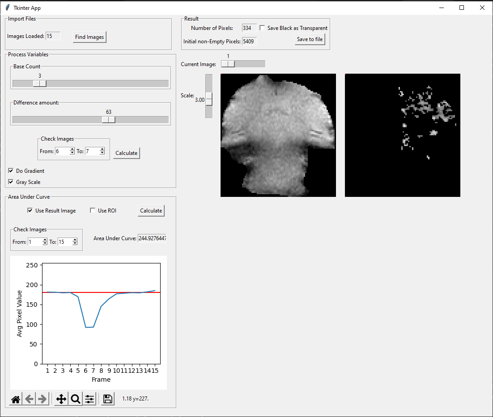

# About this project

This is a simple python tkinter app used to aid in image analysis

To read the 2dseq Brucker files this project will use
`BrukerMRI.py` from [jdoepfert's brukerMRI module](https://github.com/jdoepfert/brukerMRI)
But this is not inplemented y
# How To run:
If you have python installed and all the correct packages simply running tkinterApp.py with python should work

If you are on windows you could try running the run.bat file

To make sure you have python installed open a command prompt and run:

`python --version`

Make sure your python version is at least 3.4, while this app was written in Python 3.9.7 and it is recommended to use it or a newer version it may run in older versions

## Running without a Virtual Environment:
Make sure your have pip installed by opening a command prompt and running:

`pip --version`

Any version should work. Next verify all required packages are installed by running:

`pip install tk pillow numpy`

Finally start the app by going to the directory it is in and running:

`python tkinterApp.py`

## Running with a Virtual Environment:
Open a command prompt and change directory to the one where the file is saved
Next create a virtual environment by running the command:

`virtualenv {name}`

where {name} can be any name for the folder I recommend tkinterEnv so it will look like:

`virtualenv tkinterEnv`

Next activate the virtual environment
For Windows the command is:

`{name}\Scripts\activate.bat`

For Linux and MacOS the command is:

`source {name}/bin/activate`

For Windows PowerShell the command is:

`{name}\Scripts\activate.ps1`

where once again {name} is replaced by the name given to the virtual environment earlier
so if you are using tkinterEnv the Windows command will be:

`tkinterEnv\Scripts\activate.bat`

For Linux and MacOS it will be:

`source tkinterEnv/bin/activate`

For Windows PowerShell the command is:

`tkinterEnv\Scripts\activate.ps1`

If everything worked correctly you should see the command line has the name of the virtual environment to the left of it    
Next we install the required packages by running the command:

`pip install -r requirements.txt`

Finally we can run the app, simply run:

`python tkinterApp.py`

Now that the virtual environment is set up you will not need to go through the whole setup again simply activate the virtual environment and run the app
When you decide to deactivate the virtual environment simply run the command:

`deactivate`

